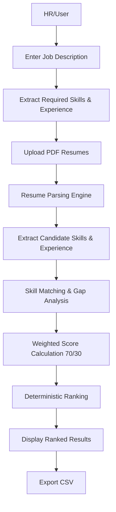

# 🧠 KAABIL LENS (Intelligent Resume Screening & Candidate Ranking)

> Explainable 70/30 weighted candidate evaluation — deterministic & no black-box AI

---

## Made By

---

1. **Mustafa Ahmed Siddiqui** – Cyber & AI enthusiast, ( Black + White ) Hat / 2 Hacker, Competitive Programmer, Solution Expert , Electro-Tech Guru.  
   [LinkedIn](https://www.linkedin.com/in/mustafa-ahmed-venomdev421)

2. **Nouman Fazil** – AI Enthusiastic, Dedicated Automation Expert, Jigri  
   [LinkedIn](https://www.linkedin.com/in/nouman-fazil-a91478327/)

---
## 📌 Problem Understanding


Recruiters, HR teams, and university placement cells often face the following challenges:

1. **Time-consuming manual resume screening** – Reviewing dozens or hundreds of resumes is tedious.
2. **Skill mismatch** – Hard to identify which candidates meet the exact skill requirements.
3. **Inconsistent evaluations** – Human bias and subjective scoring lead to unreliable candidate rankings.
4. **Experience normalization** – Candidates report experience differently (months vs years), complicating comparison.
5. **Lack of transparency** – Candidates and managers often cannot justify ranking outcomes.

**Goal:** Build a transparent, explainable system that automates candidate ranking based on skills and experience, while producing deterministic, reproducible results.

---

## 🧩 Approach

The solution is structured as a multi-step pipeline:

1. **Job Description Analysis**

   * Parse text input for required skills and experience.
   * Normalize skills to canonical forms (e.g., "Py" → "Python").

2. **Resume Upload & Processing**

   * Accept multiple PDF resumes.
   * Extract candidate skills and experience using regex-based parsing with minor AI assistance.

3. **Skill Matching & Gap Analysis**

   * Compare candidate skills with job requirements.
   * Identify missing skills (skill gap report).

4. **Weighted Scoring**

   * Compute final score:

     ```text
     Final Score = (0.7 × Skill Match %) + (0.3 × Experience Score %)
     ```
   * Sort candidates deterministically (tie-breaking by skill match and experience).

5. **Output & CSV Export**

   * Display results in tables with matched/missing skills.
   * Allow CSV export for reporting and record keeping.

**Workflow Diagram:**



---

## ⚙ Implementation Highlights

* **Backend:** Python classes handle job description parsing, resume parsing, scoring, and ranking.
* **Frontend:** Next.js app with modern React components:

  1. Job description input & analysis
  2. Resume upload & processing
  3. Candidate ranking results with CSV download
* **Skill Normalization:** Canonical mapping and regex-based cleaning for consistent comparisons.
* **Session Management:** React state and API calls for multi-step workflow.
* **CSV Export:** Pandas DataFrame converts ranked candidates into downloadable CSVs.

---

## ⚡ Challenges Faced

1. **Inconsistent Resume Formats**

   * PDF extraction can fail if text is embedded as images.
   * Solution: Use `PyMuPDF` to extract text and handle empty pages gracefully.

2. **Canonical Skill Matching**

   * Different naming conventions ("Node JS", "Node.js") required normalization.
   * Solution: Built a canonical map and text normalization pipeline.

3. **Frontend Integration**

   * Maintaining multi-step flow in Next.js while keeping data persistent.
   * Solution: Used React state and API calls for job data, uploaded resumes, and processed results.

4. **Loading Feedback for Users**

   * Processing multiple PDFs can take time.
   * Solution: Added loading spinners for extraction, analysis, and scoring stages.

5. **Deterministic Tie-Breaking**

   * Candidates with identical scores needed predictable ordering.
   * Solution: Sort by final score → skill match → experience.

---

## 🏗 Features Implemented

* Multi-step Next.js frontend:

  * Step 1: Job description input & skill extraction
  * Step 2: Resume upload & processing
  * Step 3: Ranked candidate table with skill gap expanders and CSV export
* Skill normalization & canonicalization
* Weighted scoring logic
* Deterministic ranking
* Skill gap detection (missing skills per candidate)
* CSV export for HR reporting
* State management & reset functionality
* Loading animations during backend processing

---

## 📊 Example Extracted Requirements

**Required Skills:**

```text
python, go, terraform, airflow, postgresql, redis, docker, microservices, ci/cd, aws, gcp
```

**Required Experience:** `3.0 years`

---

## 📈 Sample Ranked Output

| Rank | Candidate | Skill Match (%) | Experience Match (%) | Final Score |
| ---- | --------- | --------------- | -------------------- | ----------- |
| 1    | Alice     | 85              | 90                   | 87.5        |
| 2    | Bob       | 75              | 100                  | 82.5        |
| 3    | Charlie   | 70              | 80                   | 73          |

Each candidate includes an expandable section for:

* **Matched Skills**
* **Missing Skills** (Skill Gap Report)

---

## 🛠 Tech Stack

* **Frontend:** Next.js with React
* **Backend:** Python with FastAPI
* **PDF Parsing:** PyMuPDF (fitz)
* **Data Handling:** Pandas
* **Optional AI Assistance:** Groq API for skill/experience extraction

---

# 🚀 How to Run

1. **Clone the project and navigate to the directory:**

   ```bash
      git clone -b main_Updated https://github.com/m-noumanfazil/KAABIL-LENS.git --single-branch
      cd KAABIL-LENS
   ```

2. **Set up a virtual environment (venv):**

   ```bash
      python -m venv venv
   ```

   * Activate the environment:

     * **Linux/macOS:**

       ```bash
       source venv/bin/activate
       ```
     * **Windows:**

       ```bash
       venv\Scripts\activate
       ```
   * Install dependencies:

     ```bash
     pip install -r requirements.txt
     cd web_frontend
     npm install
     ```

3. **Set up GROQ AI account and API key:**

   * Go to [GROQ AI](https://groq.ai) and create a free account.
   * In the dashboard, generate a new API key.
   * Copy the key.

4. **Configure `.env` file:**

   * In the project root, create a `.env` file (or edit existing one).
   * Add the following line:

     ```env
     GROQ_API_KEY="your_copied_api_key_here"
     ```

5. **Run the project (backend + frontend together):**

   ```bash
   cd ..
   python run.py
   ```

   * Frontend(Main) → [http://localhost:3000](http://localhost:3000)
   * Backend API → [http://localhost:8000](http://localhost:8000)

6. **Optional: Run frontend and backend separately:**

   **Backend only:**

   ```bash
   cd backend
   uvicorn backend_api:app --reload
   ```

   **Frontend only:**

   ```bash
   cd web_frontend
   npm run dev
   ```

## ⚡ How This Project Makes a Difference

Without this system, an individual or HR team would face:

* Hours of manual resume screening
* Difficulty comparing skill sets fairly
* Ambiguity in ranking decisions
* Risk of hiring mismatched candidates

This system removes manual bias, ensures transparency, and reduces evaluation time dramatically.

---

## 🔮 Future Improvements

* Semantic NLP for skill extraction
* PDF skill gap report generation
* Docker deployment with docker-compose
* Database integration for larger candidate pools
* Advanced UI/UX enhancements

---

## 📄 License

MIT License